# CI/CD Demo

This repository demonstrates a CI/CD pipeline using Google Cloud Platform services.

### Step 1: Set Environment Variables

First, clone the forked sample repository in the Google Cloud console. Modify the `vars.sh` file located at the root of the Git repository to match your Google Cloud environment.

```bash
# The region where the resources are deployed
export CLUSTER_REGION="us-central1"

# The prefix for the names of staging and production clusters
export CLUSTER_NAME="cicd-demo"

# The domain name for the production ingress
export DOMAIN="demo.electronspark.xyz"

# The domain name for the staging ingress
export STAGING_DOMAIN="demo-staging.electronspark.xyz"

# The name associated with your globally reserved external static IP for production ingress
export PRODUCTION_INGRESS_IP_NAME="web-ip"

# The name associated with your globally reserved external static IP for staging ingress
export STAGING_INGRESS_IP_NAME="staging-ip"

# The owner of the GitHub repository, either a user or organization
export REPO_OWNER="electronspark-devops-demo"

# The name of the GitHub repository
export REPO_NAME="ci-cd-demo"

# The name of the Artifact Registry
export DEFAULT_REPO="ci-cd-demo"
```

Execute the following command to load the environment variables:

```bash
source vars.sh
```

Then, run the substitute.sh script. This script modifies parts of the Cloud Deploy configuration files as well as some Kustomize YAML files to adapt them to your environment:

```bash
sh substitute.sh
```

### Step 2: Enable Required Google Cloud APIs

Enable the necessary Google Cloud APIs:

```bash
gcloud services enable container.googleapis.com \
    cloudbuild.googleapis.com \
    clouddeploy.googleapis.com \
    storage-component.googleapis.com \
    storage.googleapis.com \
    artifactregistry.googleapis.com
```

### Step 3: Configure IAM Permissions

Ensure the default Compute Engine service account has the necessary permissions. Assign the `iam.serviceAccountUser` role, which includes the `actAs` permission, to deploy to the runtime:

```bash
gcloud projects add-iam-policy-binding $PROJECT_ID \
    --member=serviceAccount:${SERVICE_ACCOUNT_EMAIL} \
    --role="roles/clouddeploy.jobRunner"

gcloud projects add-iam-policy-binding $PROJECT_ID \
    --member=serviceAccount:${SERVICE_ACCOUNT_EMAIL} \
    --role="roles/container.developer"

gcloud projects add-iam-policy-binding $PROJECT_ID \
    --member=serviceAccount:${SERVICE_ACCOUNT_EMAIL} \
    --role="roles/clouddeploy.jobRunner"

gcloud iam service-accounts add-iam-policy-binding ${SERVICE_ACCOUNT_EMAIL} \
    --member=serviceAccount:${SERVICE_ACCOUNT_EMAIL} \
    --role="roles/iam.serviceAccountUser" \
    --project=$PROJECT_ID
```

### Step 4: Create Artifact Registry

Create an Artifact Registry to store Docker images built during the CI process:

```bash
gcloud artifacts repositories create $DEFAULT_REPO \
  --repository-format=docker \
  --location=$CLUSTER_REGION
```

### Step 5: Create Storage Buckets

Create a Storage Bucket to store Skaffold cache files:

```bash
gcloud storage buckets create gs://$STORAGE_BUCKET_NAME --location=$CLUSTER_REGION
gsutil versioning set on gs://$STORAGE_BUCKET_NAME

gcloud storage buckets create gs://$STAGING_BUCKET_NAME --location=$CLUSTER_REGION
gsutil versioning set on gs://$STAGING_BUCKET_NAME
```

### Create an empty Skaffold cache file to be downloaded during the first CI pipeline run:

```bash
gsutil cp /dev/null gs://$STORAGE_BUCKET_NAME/cache
```

### Step 6: Create GKE Autopilot Clusters

Create two GKE Autopilot clusters—one for staging and one for production:

```bash
gcloud container clusters create-auto $STAGING_CLUSTER_NAME --region $CLUSTER_REGION
gcloud container clusters create-auto $PRODUCTION_CLUSTER_NAME --region $CLUSTER_REGION
```

### Step 7: Reserve Global Static IPs

Reserve global static IP addresses for both production and staging ingresses:

```bash
gcloud compute addresses create $PRODUCTION_INGRESS_IP_NAME \
    --global \
    --ip-version IPV4

gcloud compute addresses create $STAGING_INGRESS_IP_NAME \
    --global \
    --ip-version IPV4
```

### Step 8: (Optional) Update kubectl Configuration

This step is optional. If you need to switch between clusters using kubectl, you can update the kubectl configuration file:

```bash
gcloud container clusters get-credentials $STAGING_CLUSTER_NAME --region $CLUSTER_REGION
```

### Step 9: Deploy to Staging Cluster

Use Skaffold to build staging images and deploy them to the staging cluster:

```bash
skaffold run -f=skaffold.yaml -p staging \
--default-repo=${CLUSTER_REGION}-docker.pkg.dev/${PROJECT_ID}/${DEFAULT_REPO}
```

### Step 10: Connect Cloud Build to GitHub

Before creating the Cloud Build Trigger, you need to connect Cloud Build to your target GitHub repository.

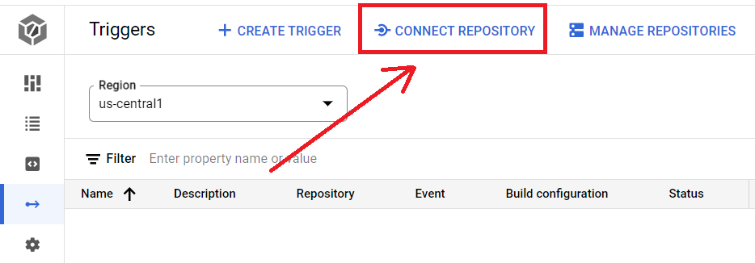

In the Google Cloud console, navigate to **Cloud Build > Triggers**.
Select **GitHub (Cloud Build GitHub App)** as your source code management provider.

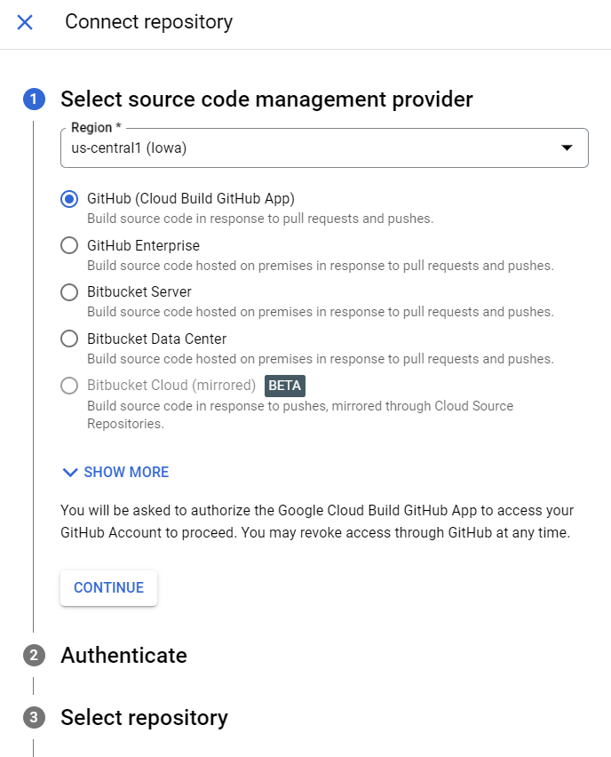

After completing the GitHub authentication, select the repository you want to connect.

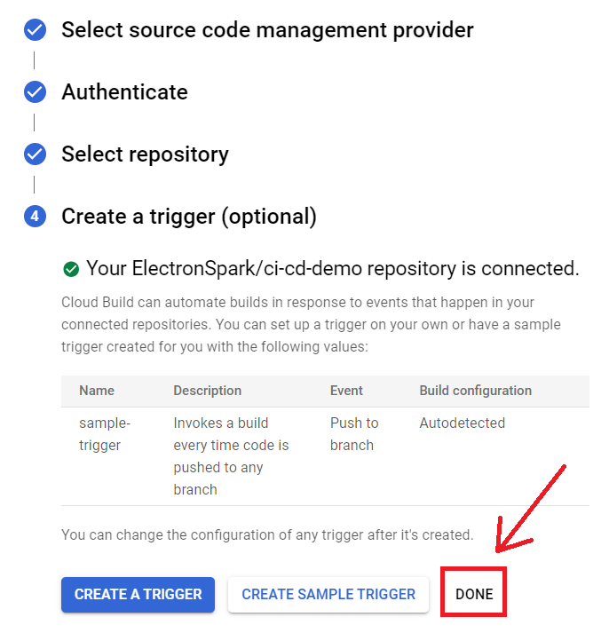

Confirm the connection without creating a trigger yet.

### Step 11: Create Cloud Build Trigger

Create a Cloud Build Trigger that will be triggered whenever the main branch of the Git repository changes. The CI pipeline will use the default Compute Engine service account:

```bash
gcloud builds triggers create github --name="${BUILD_PIPELINE_NAME}" \
            --service-account="projects/${PROJECT_ID}/serviceAccounts/${SERVICE_ACCOUNT_EMAIL}" \
            --repo-owner="${REPO_OWNER}" \
            --repo-name="${REPO_NAME}" --branch-pattern="^main$" \
            --build-config="cloudbuild.yaml" \
            --region=${CLUSTER_REGION} \
            --substitutions=_REGION=${CLUSTER_REGION},_CLUSTER=hello-cloudbuild,_CACHE_URI=gs://$STORAGE_BUCKET_NAME,_DELIVERY_PIPELINE_NAME=$DELIVERY_PIPELINE_NAME,_SOURCE_STAGING_BUCKET=gs://$STAGING_BUCKET_NAME,_DEFAULT_REPO=$DEFAULT_REPO,_PROJECT_ID=$PROJECT_ID
```

After creating the Trigger, navigate to **Cloud Build > Triggers** to view the newly created Trigger.

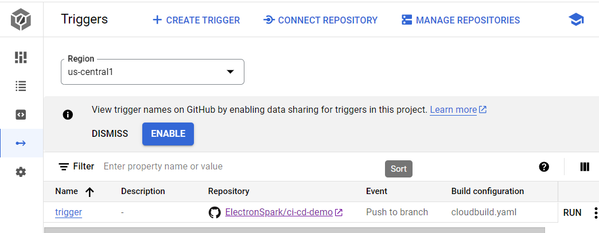

### Step 12: Configure Cloud Deploy

Create a Cloud Deploy delivery pipeline and two targets (staging and production) based on the `deploy.yaml` file in the root directory of the Git repository:

```bash
gcloud deploy apply --file=deploy.yaml --region=$CLUSTER_REGION --project=$PROJECT_ID
```

Once the Delivery Pipeline is created, you can view it in **Cloud Deploy -> Delivery Pipelines**.

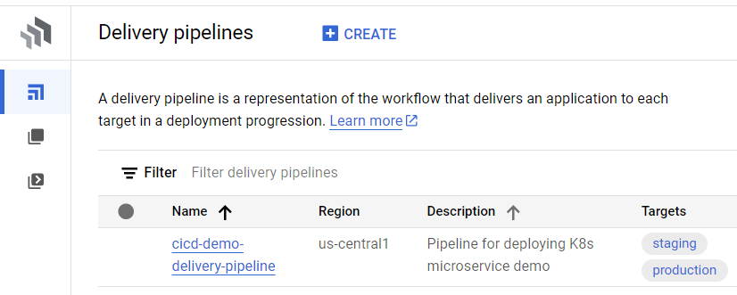

You can also view the Cloud Deploy Targets associated with this pipeline in **Cloud Deploy -> Targets**.

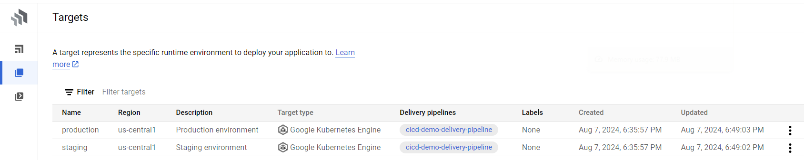

### Step 13: Trigger the CI Pipeline

Now, make changes to your code and commit them to GitHub. This action will trigger the Cloud Build CI pipeline.

```bash
git add --all
git commit -m "some changes"
git push
```

### Step 14: Verify Build and Deployment

In the Google Cloud console, navigate to **Cloud Build > History** to view the build records.

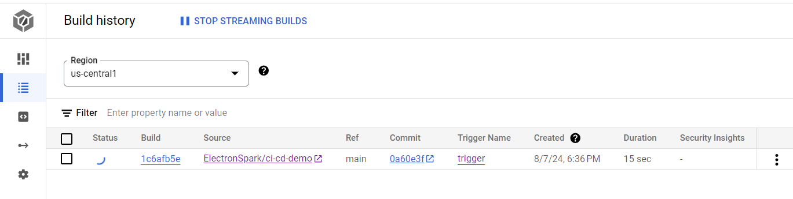

Click on the triggered Cloud Build Record to see the execution details of the CI pipeline. The following image shows a successful Cloud Build Trigger execution:

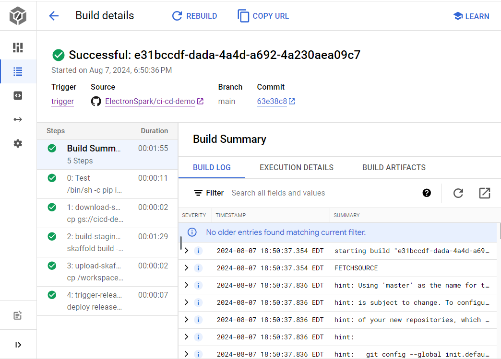

打开 Cloud Delivery Pipeline 的详细界面，可以看到 CD Pipeline 已经将 App 部署到了 Staging Cluster 之上。

Open the Cloud Delivery Pipeline detail page to see that the CD Pipeline has deployed the app to the Staging Cluster.

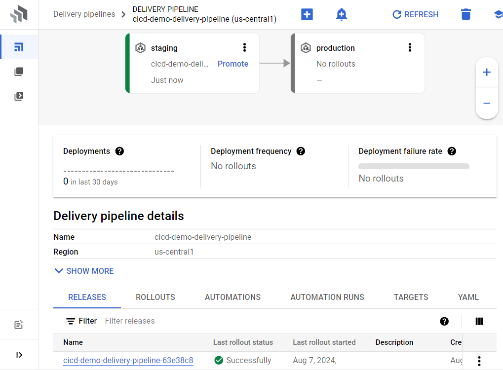

Verify the delivery by checking the staging domain homepage.

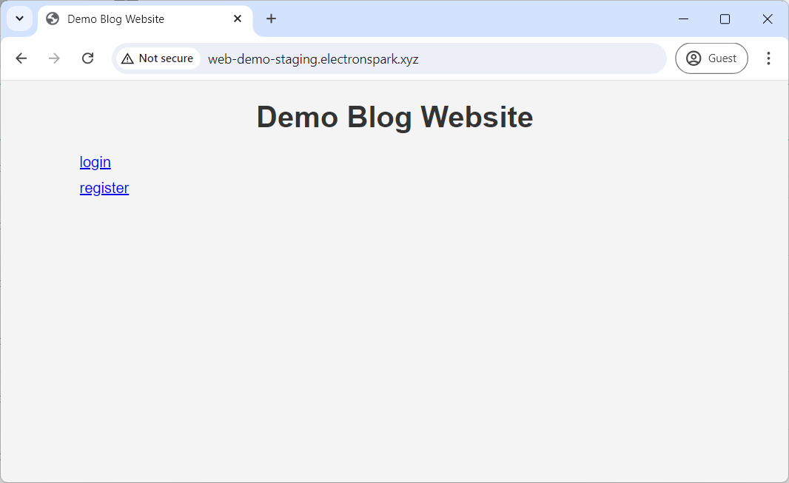

At this point, the production domain homepage will be inaccessible because the release has not yet been promoted from Staging to Production.

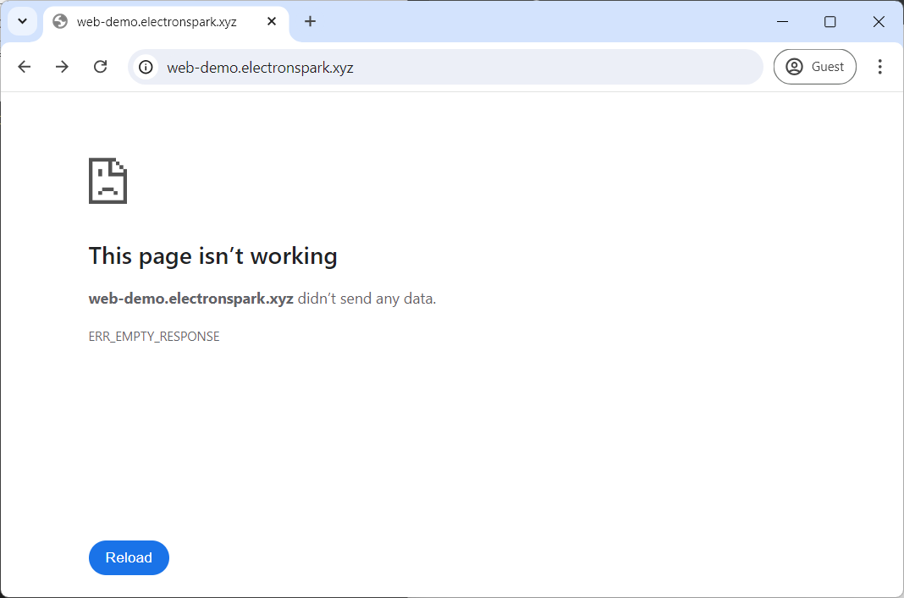

If no issues are found during the Staging phase, return to the Delivery Pipeline detail page and promote the release to the Production cluster as shown below.

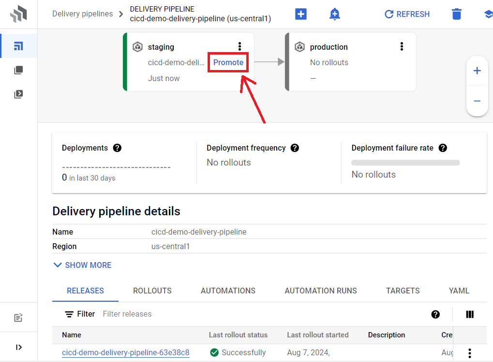

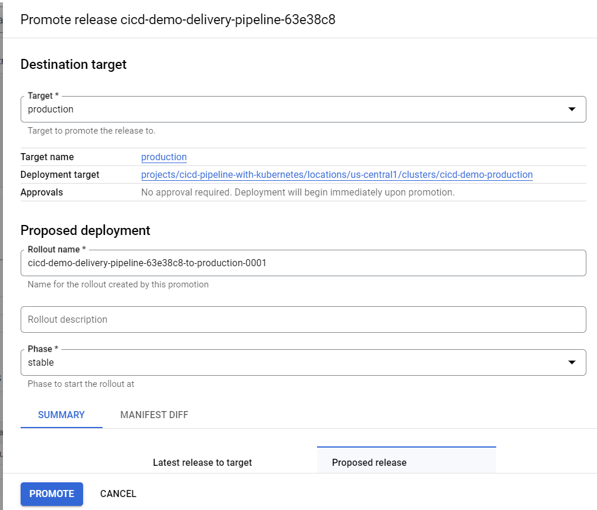

After successfully deploying to the Production Cluster, the Delivery Pipeline detail page will show the following:

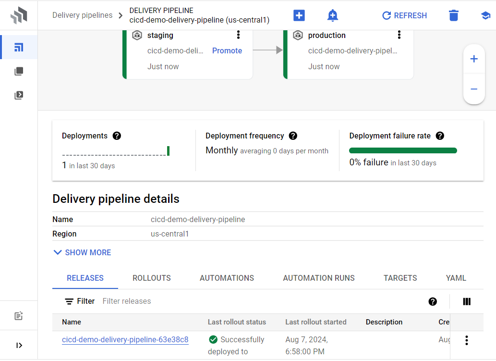

现在再尝试访问 Production Domain 的首页，已经成功加载首页的内容。

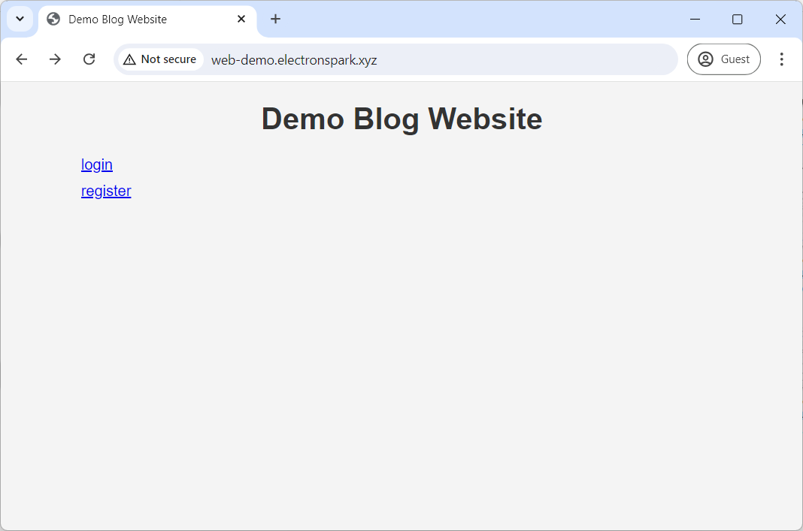

### Step 15: Testing the CI Pipeline

The CI pipeline performs a series of tests before packaging the code into a container image and creating a new release in the CD pipeline. This sample repository includes a simple unit test to demonstrate how the CI pipeline automatically tests the code.

The test calls the `get_index_title` function in `src/frontend/app.py`, and the test passes only if the function returns "Demo Blog Website". Now, make the following change to the function and commit the change to GitHub:

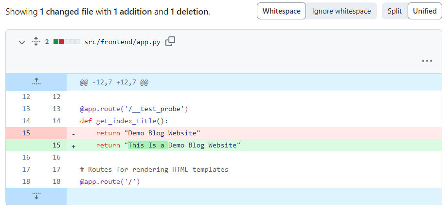

Go back to **Cloud Build > History** to check the execution status of the latest trigger. As shown below, the Cloud Build failed during the testing step, causing subsequent steps to be skipped.

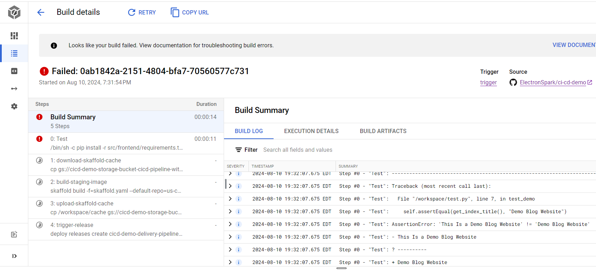

https://cloud.google.com/build/docs/automate-builds