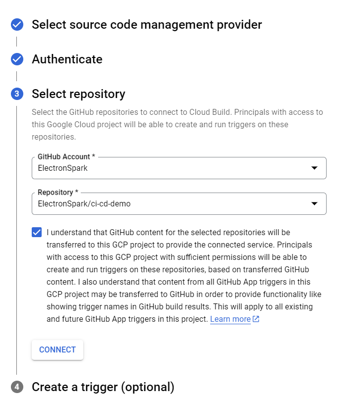

# CI/CD Demo

This repository demonstrates a CI/CD pipeline using Google Cloud Platform services.

### Step 1: Set Environment Variables

First, clone the forked sample repository in the Google Cloud console. Modify the `vars.sh` file located at the root of the Git repository to match your Google Cloud environment.

```bash
# The region where the resources are deployed
export CLUSTER_REGION="us-central1"

# The prefix for the names of staging and production clusters
export CLUSTER_NAME="cicd-demo"

# The domain name for the production ingress
export DOMAIN="demo.electronspark.xyz"

# The domain name for the staging ingress
export STAGING_DOMAIN="demo-staging.electronspark.xyz"

# The name associated with your globally reserved external static IP for production ingress
export PRODUCTION_INGRESS_IP_NAME="web-ip"

# The name associated with your globally reserved external static IP for staging ingress
export STAGING_INGRESS_IP_NAME="staging-ip"

# The owner of the GitHub repository, either a user or organization
export REPO_OWNER="electronspark-devops-demo"

# The name of the GitHub repository
export REPO_NAME="ci-cd-demo"

# The name of the Artifact Registry
export DEFAULT_REPO="ci-cd-demo"
```

Execute the following command to load the environment variables:

```bash
source vars.sh
```

Then, run the substitute.sh script. This script modifies parts of the Cloud Deploy configuration files as well as some Kustomize YAML files to adapt them to your environment:

```bash
sh substitute.sh
```

### Step 2: Enable Required Google Cloud APIs

Enable the necessary Google Cloud APIs:

```bash
gcloud services enable container.googleapis.com \
    cloudbuild.googleapis.com \
    clouddeploy.googleapis.com \
    storage-component.googleapis.com \
    storage.googleapis.com \
    artifactregistry.googleapis.com
```

### Step 3: Configure IAM Permissions

Ensure the default Compute Engine service account has the necessary permissions. Assign the `iam.serviceAccountUser` role, which includes the `actAs` permission, to deploy to the runtime:

```bash
gcloud projects add-iam-policy-binding $PROJECT_ID \
    --member=serviceAccount:${SERVICE_ACCOUNT_EMAIL} \
    --role="roles/clouddeploy.jobRunner"

gcloud projects add-iam-policy-binding $PROJECT_ID \
    --member=serviceAccount:${SERVICE_ACCOUNT_EMAIL} \
    --role="roles/container.developer"

gcloud projects add-iam-policy-binding $PROJECT_ID \
    --member=serviceAccount:${SERVICE_ACCOUNT_EMAIL} \
    --role="roles/clouddeploy.jobRunner"

gcloud iam service-accounts add-iam-policy-binding ${SERVICE_ACCOUNT_EMAIL} \
    --member=serviceAccount:${SERVICE_ACCOUNT_EMAIL} \
    --role="roles/iam.serviceAccountUser" \
    --project=$PROJECT_ID
```

### Step 4: Create Artifact Registry

Create an Artifact Registry to store Docker images built during the CI process:

```bash
gcloud artifacts repositories create $DEFAULT_REPO \
  --repository-format=docker \
  --location=$CLUSTER_REGION
```

### Step 5: Create Storage Buckets

Create a Storage Bucket to store Skaffold cache files:

```bash
gcloud storage buckets create gs://$STORAGE_BUCKET_NAME --location=$CLUSTER_REGION
gsutil versioning set on gs://$STORAGE_BUCKET_NAME

gcloud storage buckets create gs://$STAGING_BUCKET_NAME --location=$CLUSTER_REGION
gsutil versioning set on gs://$STAGING_BUCKET_NAME
```

### Create an empty Skaffold cache file to be downloaded during the first CI pipeline run:

```bash
gsutil cp /dev/null gs://$STORAGE_BUCKET_NAME/cache
```

### Step 6: Create GKE Autopilot Clusters

Create two GKE Autopilot clusters—one for staging and one for production:

```bash
gcloud container clusters create-auto $STAGING_CLUSTER_NAME --region $CLUSTER_REGION
gcloud container clusters create-auto $PRODUCTION_CLUSTER_NAME --region $CLUSTER_REGION
```

### Step 7: Reserve Global Static IPs

Reserve global static IP addresses for both production and staging ingresses:

```bash
gcloud compute addresses create $PRODUCTION_INGRESS_IP_NAME \
    --global \
    --ip-version IPV4

gcloud compute addresses create $STAGING_INGRESS_IP_NAME \
    --global \
    --ip-version IPV4
```

### Step 8: (Optional) Update kubectl Configuration

This step is optional. If you need to switch between clusters using kubectl, you can update the kubectl configuration file:

```bash
gcloud container clusters get-credentials $STAGING_CLUSTER_NAME --region $CLUSTER_REGION
```

### Step 9: Deploy to Staging Cluster

Use Skaffold to build staging images and deploy them to the staging cluster:

```bash
skaffold run -f=skaffold.yaml -p staging \
--default-repo=${CLUSTER_REGION}-docker.pkg.dev/${PROJECT_ID}/${DEFAULT_REPO}
```

### Step

在创建 Cloud Build Trigger 前需要先将 Cloud Build 连接到目标的 Github 仓库。


选择 Github (Cloud Build GitHub App)


在完成 github 的认证后，选择需要连接的仓库。



最后先不在这里创建 Trigger。


### Step 10: Create Cloud Build Trigger

Create a Cloud Build Trigger that will be triggered whenever the main branch of the Git repository changes. The CI pipeline will use the default Compute Engine service account:

```bash
gcloud builds triggers create github --name="${BUILD_PIPELINE_NAME}" \
            --service-account="projects/${PROJECT_ID}/serviceAccounts/${SERVICE_ACCOUNT_EMAIL}" \
            --repo-owner="${REPO_OWNER}" \
            --repo-name="${REPO_NAME}" --branch-pattern="^main$" \
            --build-config="cloudbuild.yaml" \
            --region=${CLUSTER_REGION} \
            --substitutions=_REGION=${CLUSTER_REGION},_CLUSTER=hello-cloudbuild,_CACHE_URI=gs://$STORAGE_BUCKET_NAME,_DELIVERY_PIPELINE_NAME=$DELIVERY_PIPELINE_NAME,_SOURCE_STAGING_BUCKET=gs://$STAGING_BUCKET_NAME,_DEFAULT_REPO=$DEFAULT_REPO,_PROJECT_ID=$PROJECT_ID
```

完成了对 Trigger 的创建后，在 **Cloud Build -> Triggers** 页面中可以看到刚刚创建的 Trigger


### Step 11: Configure Cloud Deploy

Create a Cloud Deploy delivery pipeline and two targets (staging and production) based on the `deploy.yaml` file in the root directory of the Git repository:

```bash
gcloud deploy apply --file=deploy.yaml --region=$CLUSTER_REGION --project=$PROJECT_ID
```

完成 Delivery Pipeline 的创建后，在 **Cloud Deploy -> Delivery Pipelines** 页面中可以看到刚刚创建的 Pipeline。


而在 **Cloud Deploy -> Targets** 页面中可以看到与该 Pipeline 一同创建的 Cloud Deploy Targets。


### Step 12: Trigger the CI Pipeline

Now, make changes to your code and commit them to GitHub. This action will trigger the Cloud Build CI pipeline.

```bash
git add --all
git commit -m "some changes"
git push
```

### Step 13: Verify Build and Deployment

In the Google Cloud console, navigate to **Cloud Build > History** to view the build records.


点击刚刚被触发的 Cloud Build Record，查看 CI Pipeline 的执行细节。下图为 Cloud Build Trigger 成功执行后的截图。


打开 Cloud Delivery Pipeline 的详细界面，可以看到 CD Pipeline 已经将 App 部署到了 Staging Cluster 之上。


Verify the delivery by checking the staging domain homepage.


而 production domain 的首页却无法访问，这是因为现在还没有将当前的 Release 从 Staging promote 到 Production。


如果 App 在 Staging 阶段没有发现任何问题，就可以回到 Delivery Pipeline 的详细页面将其 promote 到 Production cluster（如下图所示）。


完成在 Production Cluster 的部署后 Delivery Pipeline 的详细界面会显示如下图所示。


现在再尝试访问 Production Domain 的首页，已经成功加载首页的内容。


CI Pipeline 在将更改后的代码打包成容器镜像并在 CD Pipeline 中创建新的 Release 之前，会先进行一系列测试。本示例仓库包含一个简单的单元测试，用于展示 CI Pipeline 如何自动对代码进行测试。该测试会调用 `src/frontend/app.py` 中的 `get_index_title` 函数，只有当其返回了 “Demo Blog Website” 时该测试才算通过。现在就对该函数做出如下的改动，再将这个改动提交到github上


回到 **Cloud Build > History** 中查看最新一次Trigger的执行情况，可以看到 Cloud Build 在测试的这一步骤中执行失败，因此下面的步骤也就此被放弃。


https://cloud.google.com/build/docs/automate-builds